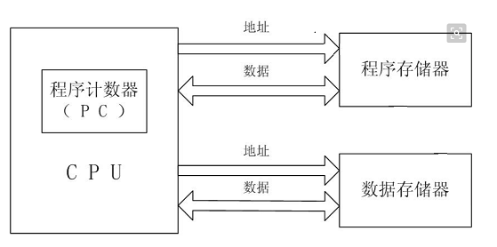
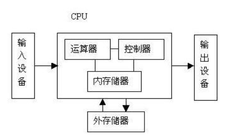
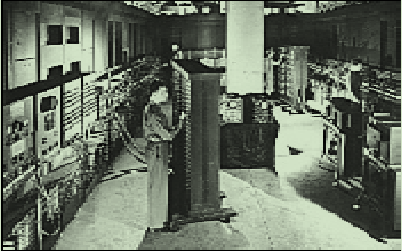
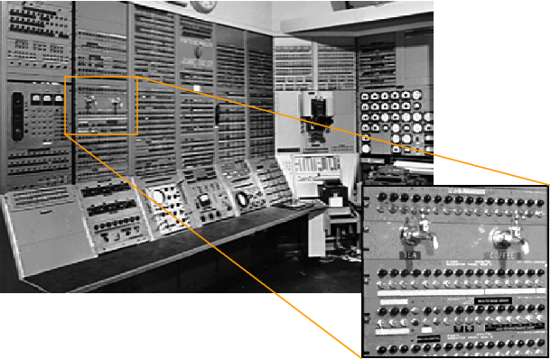

### 1.1 第一代(1945-1958)
>起草人：[尹航](mailto:)，[魏小辉](mailto:weixh16@lzu.edu.cn)

#### 一、特征

* 真空管
* 机器代码，汇编语言，无操作系统
* 计算机中包含一个特定的中央处理器
* 不同类型的指令，几台机器可以被认为是“通用”的
* 使用磁鼓存储器或磁芯存储器，通过纸带或穿孔卡片来加载程序和数据
* 2 KB的内存，10 KIPS

#### 二、计算机的两种模型：

1. 哈佛架构 - 程序指令存储和数据存储分开的物理存储结构（这个术语源自哈佛的Mark I，这是一台基于继电器的计算机，它通过穿孔纸带和继电器锁存数据来存储指令。）

	(1)哈佛架构是一种将程序指令存储和数据存储分开的存储器结构。

	(2)哈佛结构是一种并行体系结构，它的主要特点是将程序和数据存储在不同的存储空间中，即程序存储器和数据存储器是两个独立的存储器，每个存储器独立编址、独立访问。

	

2. 冯·诺伊曼架构 - 一个将指令和数据同时存放在存储器中的存储结构。这样的机器也被称为存储程序计算机。

	(1)冯·诺依曼架构将指令和数据同时存放在存储器中。

	(2)计算机由控制器、运算器、存储器、输入设备、输出设备五部分组成,　冯·诺依曼提出的计算机体系结构，奠定了现代计算机的结构理念。 

	(3)冯·诺依曼瓶颈 - 相比存储器而言，CPU和存储器之间的带宽或数据传输比率太小了。

	

注：*现代高性能CPU芯片采用将以上两种架构相结合的设计方式。缓存被分为一个指令缓存和一个数据缓存。哈佛架构被用作CPU访问缓存，冯诺依曼架构被用于片外存储器访问。*

#### 三、第一阶段计算机发展史

1. 1943年至1946年，ENIAC（电子数字积分计算机）世界上第一台电子计算机，由四位科学家和工程师埃克特、莫克利、戈尔斯坦、博克斯所创造。这台计算机是十进制的，并且能每秒计算5000次加法和357次乘法。ENIAC被用于第二次世界大战中导弹轨迹的计算，技术上通过编程设置开关和堵塞＆非阻塞电缆控制。它使用了18000个电子管，耗电量150千瓦。
	
2. 1949年，麻省理工学院用5000真空管创建了旋风计算机，主要创新是磁芯存储器 
	
3. 1951 UNIVAC（通用自动计算机）- 第一台商用计算机，由埃克特和莫齐利创建，花费大约100万美元，卖出了46台作为商品销售。UNIVAC使用磁带作为输入介质，计算加法只需要120微秒，乘法1800微秒，除法3600微秒。
4. 1953年，IBM的701，第一个成功的商业通用计算机。 701有静电存储管存储器，用磁带存储信息，并具有二进制的，固定的，单地址硬件。
5. 1955年，IBM650 - 第一次大规模生产的计算机（在一年内卖出了450台）