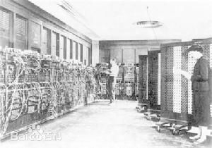

### 1.2 第二代(1958 - 1964)
>起草人：[赵益明](mailto:zhaoym16@lzu.edu.cn)，[王聚生](mailto:jvshwang@163.com)，[段鸣]()

#### 简介
1948年，[ 晶体管 ](http://baike.baidu.com/item/%E6%99%B6%E4%BD%93%E7%AE%A1/569042)
的发明大大促进了计算机的发展，晶体管代替了体积庞大电子管，电子设备的体积不断减小。1956年，晶体管在计算机中使用，晶体管和磁芯存储器导致了第二代计算机的产生。1958年，美国的IBM公司制成了第一台全部使用晶体管的计算机RCA501型。1960年，出现了一些成功地用于商业领域、大学和政府部门的第二代计算机。1961年，世界上最大的晶体管电子计算机ATLAS安装完毕。1964年，中国制成了第一台全晶体管电子计算机441—B型。

第二代计算机用晶体管代替电子管，还有现代计算机的一些部件：打印机、磁带、磁盘、内存、操作系统等。计算机中储存的程序使得计算机有很好的适应性，可以更有效地用于商业用途。在这一时期出现了更高级的COBOL和FORTRAN等语言，以单词、语句和数学公式代替了含混的二进制机器码，使计算机编程更容易。新的职业（程序员、分析员和计算机系统专家）和整个软件产业由此诞生。 

第一代计算机（电子管计算机）使用的是“定点运算制”，参与运算数的绝对值必须小于1；而第二代计算机（晶体管计算机）增加了浮点运算，使数据的绝对值可达2的几十次方或几百次方，计算机的计算能力实现了一次飞跃。同时，用晶体管取代电子管，使得第二代计算机体积减小，寿命大大延长，价格降低，为计算机的广泛应用创造了条件。

第一台晶体管计算机TRADIC

#### 特点
- 晶体管 --小, 低能量, 低消耗, 比真空管更可靠
- 磁芯存储器
- 2的补码, 浮点运算
- 计算的时间从毫秒缩减到微秒
- 高层次的语言
- 第一个操作系统:一次处理一个程序
- 1959年,IBM的7000系列大型机是该公司的第一晶体管计算机
- 基本周期时间: 2.18μs

#### 缺点
- 晶体管计算机产生的辐射影响人体的循环系统、免疫和代谢功能，这也是所有计算机产品的缺点。
- 对人们的视觉系统有不良影响，相较于集成电路计算机，晶体管计算机的辐射会更强。
- 和集成电路计算机相比，体积和功耗还是较大，所以多应用于军事，商业，大学等领域，普通家庭并不能应用。

#### IBM 7090
[ IBM7090 ](https://en.wikipedia.org/wiki/IBM_7090)
是当时最强大的数据处理系统. 完全由晶体管制造的系统,其速度是上一代
真空管计算机的6倍。 尽管IBM7090是一个具有通用目的的数据处理系统, 但它还是
特地满足了导弹, 喷气发动机, 核反应堆和超音速飞行器的设计需求。

包含了超过5万个晶体管, 加上超快的磁芯存储器, 当8位数据通道全部使用时,这崭
新的系统可以并发的按照每秒3百万比特的速率进行读写操作。 在2.18个百万分之一
秒内, 它就可以定位,并且准备使用储存在磁芯存储器中的32768个数据或者指令数(
各10位). 这台7090可以在一秒钟完成以下操作: 229,000次加减法, 39,500次乘
法, 或者32700次除法。

IBM 7090

#### 我国第二代计算机发展
1965年中科院计算所研制成功了我国第一台大型晶体管计算机：109乙机，标志中国电子计算机技术进入第二代。对109乙机加以改进，两年后又推出109丙机，在我国两弹试制中发挥了重要作用，被用户誉为“功勋机”。哈军工(国防科大前身)于1965年2月成功推出了441B全晶体管计算机并小批量生产了40多台，开创了国产晶体管成功应用于计算机的先河。

441B-II
