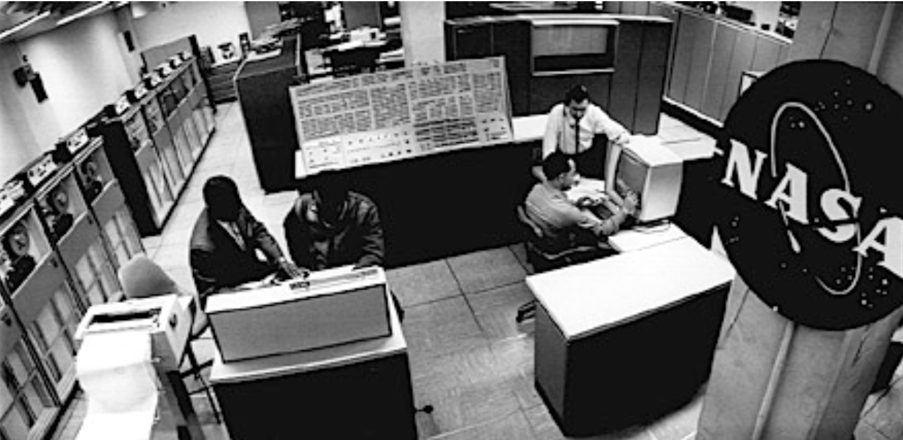
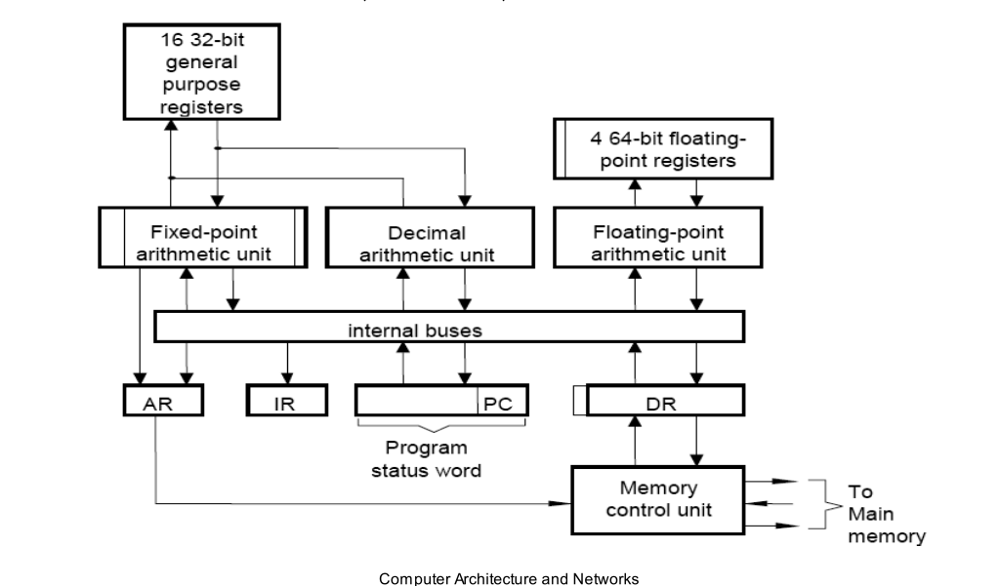

### 1.3 第三代(1964-1974)
> 起草人：[申泽邦](mailto:shenzb12@lzu.edu.cn)，[王金强](mailto:shenzb12@lzu.edu.cn)

#### 第三代的特征
* 使用集成电路使单一芯片包含数以千计的晶体管
* 半导体存储器的使用
* 分时系统，图形化界面，结构化编程
* 2 Mb内存，单字长定点指令平均执行速度5 MIPS
* 高速缓冲存储器的使用
* IBM的__System 360__——这是第一个将架构和具体应用划清界限的计算机系列

#### IBM System/360
于1966年制造的IBM System/360 Model 91是当时最快，性能最强的计算机。它被设计用于为科学计算提供高速的数据处理，这些科研应用包括空间探索，理论天体学，亚原子物理学和全球天气预报。IBM估算这台大型机每天能够解决超过1000个问题，完成大约2000亿次运算

 

IBM System/360

#### 第三代计算机结构

#### 高级计算机语言的出现
计算机语言发展到第三代时，就进入了“面向人类”的语言阶段。第三代语言也被人们称之为“高级语言”。高级语言是一种接近于人们使用习惯的程序设计语言。它允许用英文写解题的计算程序，程序中所使用的运算符号和运算式子，都和我们日常用的数学式子差不多。高级语言容易学习，通用性强，书写出的程序比较短，便于推广和交流，是很理想的一种程序设计语言。高级语言发展于50年代中叶到70年代，有些流行的高级语言已经被大多数计算机厂家采用，固化在计算机的内存里，如BASIC语言（已有不少于128种不同的BASIC语言在流行，当然其基本特征是相同的）。除了BASIC语言外，还有FORTRAN（公式翻译）语言、COBOL（通用商业语言）、C语言、DL/I语言、 PASCAC语言、ADA语言等250多种高级语言。

